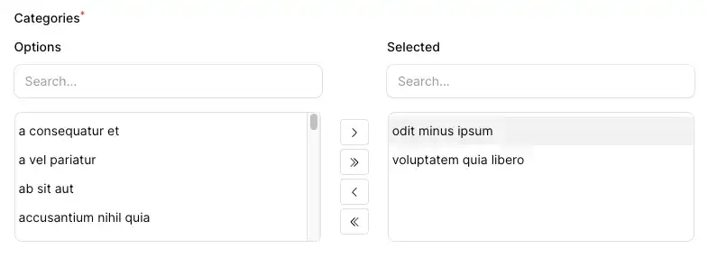

# novadaemon/filament-combobox

Side by side combo box multiselect field to use in your [filamentphp](https://filamentphp.com/) forms.

<div class="filament-hidden">
    
</div>

## Installation

You can install the package via composer:

```bash
composer require novadaemon/filament-combobox
```

This package supports Filament 3.x

## Usage

Simply use the component as you'd use any other Filament field. It's especially perfect for the resource view page where it blends right in.

```php
use Novadaemon\FilamentComboBox\ComboBox;

class FileResource extends Resource
{
    public static function form(Form $form): Form
    {
        return $form
            ->schema([
                ComboBox::make('vegetables')
                ->options([
                    'carrot' => 'Carrot',
                    'potato' => 'Potato',
                    'tomato' => 'Tomato',
                ])
            ]);
    }
}
```

Since the ComboBox component extends the **Filament\Forms\Components\Select** class, it is possible to use almost all methods of the parent component.

### Integrating with an Eloquent relationship

```php
use Novadaemon\FilamentComboBox\ComboBox;

class FileResource extends Resource
{
    public static function form(Form $form): Form
    {
        return $form
            ->schema([
                ComboBox::make('categories')
                ->relationship('categories', 'name')
            ]);
    }
}
```

## Customize

### Enabling search in the boxes

```php
use Novadaemon\FilamentComboBox\ComboBox;

class FileResource extends Resource
{
    public static function form(Form $form): Form
    {
        return $form
            ->schema([
                ComboBox::make('categories')
                ->relationship('categories', 'name')
                ->boxSearchs()
            ]);
    }
}
```

The `boxSearchs` method accepts a boolean or closure callback function.

```php
class FileResource extends Resource
{
    public static function form(Form $form): Form
    {
        return $form
            ->schema([
                ComboBox::make('categories')
                ->relationship('categories', 'name')
                ->boxSearchs(fn() => auth()->user()->isAdmin())
            ]);
    }
}
```

### Modifying the height of the component

Yo can change the height of the component using the `height` method:

```php
class FileResource extends Resource
{
    public static function form(Form $form): Form
    {
        return $form
            ->schema([
                ComboBox::make('categories')
                ->relationship('categories', 'name')
                ->height('500px')
            ]);
    }
}
```

## Customize the label of the boxes

Changing the label of the boxes:

```php
class FileResource extends Resource
{
    public static function form(Form $form): Form
    {
        return $form
            ->schema([
                ComboBox::make('categories')
                ->relationship('categories', 'name')
                ->optionsLabel('Available categories')
                ->selectedLabel('Selected categories')
            ]);
    }
}
```

Hiding the label on the boxes:

```php
class FileResource extends Resource
{
    public static function form(Form $form): Form
    {
        return $form
            ->schema([
                ComboBox::make('categories')
                ->relationship('categories', 'name')
                ->showLabels(false)
            ]);
    }
}
```

## Translations

Optionally, you can publish the translations using

```bash
php artisan vendor:publish --tag="filament-combobox-translations"
```
Now, yo can modify or add custom translation files.

## Contributing

Contributing is pretty chill and is highly appreciated! Just send a PR and/or create an issue!

## Credits

- [Jesús García](https://github.com/novadaemon)

## License

The MIT License (MIT). Please see [License File](LICENSE.md) for more information.

## Screenshot

